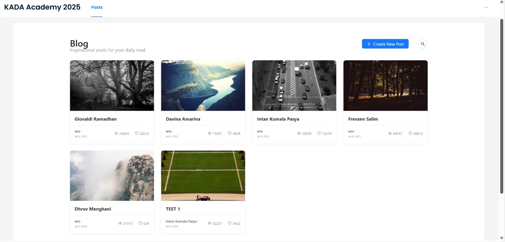

# 📝 WTV — Full-Stack Social App

This template provides a minimal setup to get React working in Vite with HMR and some ESLint rules.
WTV is a modern blog website that lets users post content while others can view, comment, and engage with those posts. It is a full-stack web application built with **Node.js**, **Express**, **React**, and **MongoDB**, allowing users to create posts, leave comments, and interact in a social environment with authentication and protected routes.

**Post List**


**Post Detail**


## Expanding the ESLint configuration
---

## Features

- User authentication with JWT
- Create, edit, and delete posts
- Comment system with nested replies
- Context-based auth state management
- RESTful API with Express
- Modular structure for scalability

---

## Tech Stack

| Frontend | Backend | Database | Auth |
|----------|---------|----------|------|
| React + Vite | Node.js + Express | MongoDB | JWT |

---

## Installation

1. **Clone the repo**
   ```bash
   git clone https://github.com/L3tzG0/WTV.git
   cd WTV

2. **Install dependencies**
   ```bash
   npm install
3. **Set up environment variables**
   ```bash
   Create a .env file in the root directory and add:
    # Database
    MONGO_URI=mongodb://127.0.0.1:27017/db
    MONGO_URL=your-remote-mongo-url-if-used

    # JWT
    JWT_SECRET=your-jwt-secret
    JWT_SECRET_KEY=your-other-jwt-key-if-different

    # OAuth
    GOOGLE_CLIENT_ID=your-google-client-id
    GOOGLE_SECRET=your-google-secret
    GOOGLE_CALLBACK_URL=http://localhost:3000/auth/google/callback

    # Email (e.g. Nodemailer config)
    EMAIL_USER=your-email@example.com
    EMAIL_PASS=your-email-password-or-app-password
    GOOGLE_APP_PASSWORD=your-app-password-if-using-gmail

    # App URLs
    BACKEND_URL=http://localhost:5000
    FRONTEND_URL=http://localhost:3000

4. **Run the app**
   ```bash
   npm run dev
---
## API Endpoints
### Authentication & User
| Method | Endpoint | Description |
|--------|----------|-------------|
| POST | /auth/signup | Register a new user |
| POST | /auth/login | User login with local strategy |
| GET  | /auth/status | Get authenticated user's info *(JWT required)* |
| POST | /auth/logout | Log out current user |
| GET  | /auth/google | Start Google OAuth login |
| GET  | /auth/login/google/callback | Handle OAuth redirect and return token |
| POST | /auth/forgot-password | Request password reset email |
| POST | /auth/reset-password/:token | Reset password via token |
| POST | /auth/send-email | Send email via Nodemailer |
| GET  | /auth/users/:userId | Fetch public profile of a user |
### Posts
| Method | Endpoint | Description |
|--------|----------|-------------|
| GET | /posts | Get all posts (supports pagination & search) |
| GET | /posts/:postId | Get single post by ID |
| POST | /posts | Create a new post *(JWT required)* |
| PUT | /posts/:postId | Update a post *(Author or Admin only)* |
| DELETE | /posts/:postId | Delete a post *(Author or Admin only)* |
### Comments
| Method | Endpoint | Description |
|--------|----------|-------------|
| GET | /posts/:postId/comments | Get all comments on a post (supports `page`/`limit`) |
| POST | /posts/:postId/comments | Add a comment to a post |
| DELETE | /posts/:postId/comments/:commentId | Delete a comment by ID |
